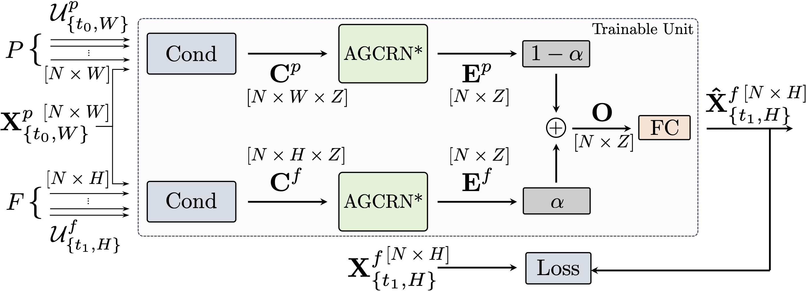
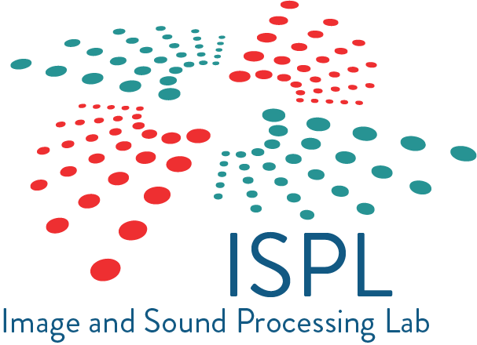

# :chart_with_upwards_trend: :round_pushpin: Back to the Future: GNN-based NO2 Forecasting via Future Covariates (IGARSS 2024) :round_pushpin: :chart_with_downwards_trend:

[](https://ieeexplore.ieee.org/document/10642608)
[](https://arxiv.org/abs/2404.05324)
[](https://www.aria-net.it/wp-content/uploads/2024/05/Un-approccio-deep-learning-per-la-predizione-di-inquinanti-Giganti.pdf)

This folder contains the implementation code of the paper 

_**Back to the Future**: GNN-based NO2 Forecasting via Future Covariates_ ([IGARSS 2024](https://www.2024.ieeeigarss.org/view_paper.php?PaperNum=5124))

**Authors**: Antonio Giganti, Sara Mandelli, Paolo Bestagini, Umberto Giuriato, Alessandro D’Ausilio, Marco Marcon, Stefano Tubaro


<p align="center" width="100%"></p>

---

## Directory structure

The directory is structured as follows:

```
.
├── dataset/
├── lib/
├   ├── models.py
├   ├── utils.py
├   └── dataset/
├       ├── Madrid_2019.csv 
├       ├── Madrid_2019_tsl.pkl
├   	└── tsl_dataset_refactor.py
├── logger/
├── model/
├── conda_env.yaml
├── experiment.yaml
├── README.yaml
└── run_experiment.py

```

## Dataset

The datasets used in the experiments is available [here](https://zenodo.org/records/7308425). 
We provide a [Torch Spatiotemporal (tsl)](https://torch-spatiotemporal.readthedocs.io/en/latest/index.html)-ready version of the data, available at `./lib/dataset/Madrid_2019_tsl.pkl`.
This was created using the `tsl_dataset_refactor.py` and the `Madrid_2019.csv` data.

## Configuration files

The `experiment.yaml` file stores all the parameter used to run the experiment. 
The results of the experiment are stored in the `./logs/` folder.

## Requirements

To solve all dependencies, we recommend using [Anaconda](https://conda.io/projects/conda/en/latest/user-guide/tasks/manage-environments.html#activating-an-environment) and the provided environment configuration by running the command:

```bash
conda env create -f conda_env.yml
conda activate conda_env
```

## Experiments

The script used for the experiments in the paper is the `run_experiment.py` file.
Change the settings in the `experiment.yaml` file according to the settings you want to use for the experiment, i.e., the model, the training parameters, etc.
In addition, you have to set the `ROOT_PATH` in the `./lib/utils.py` according to your configuration.
After that, run the script with the command:

```bash
python run_experiment.py 
```

## Citation 

```BibTeX
@inproceedings{giganti_magcrn_2024,
    author = {Giganti, Antonio and Mandelli, Sara, and Bestagini, Paolo and Giuriato, Umberto and D’Ausilio, Alessandro and Marcon, Marco and Tubaro, Stefano},
    title = {{Back to the Future: GNN-based NO2 Forecasting via Future Covariates}},
    year = {2024}
}
```

---

## :busts_in_silhouette: About Us
**Organizations**

- Image and Sound Processing Lab ([ISPL](http://ispl.deib.polimi.it/))
- Department of Electronics, Information and Bioengineering ([DEIB](https://www.deib.polimi.it/eng/home-page))
- [Politecnico di Milano](https://www.polimi.it/en)
- [Arianet srl](https://www.aria-net.it/it/)
- [SUEZ]()

**Team**

- Antonio Giganti, [ResearchGate](https://www.researchgate.net/profile/Antonio-Giganti), [LinkedIn](https://www.linkedin.com/in/antoniogiganti/)
- Sara Mandelli, [ResearchGate](https://www.researchgate.net/profile/Sara-Mandelli), [LinkedIn](https://www.linkedin.com/in/saramandelli/)
- Paolo Bestagini, [LinkedIn](https://www.linkedin.com/in/paolo-bestagini-390b461b4/)
- Umberto Giuriato, [ResearchGate](), [LinkedIn]()
- Alessandro D’Ausilio, [ResearchGate](), [LinkedIn]()
- Marco Marcon, [LinkedIn](https://www.linkedin.com/in/marco-marcon-26140b13/)
- Stefano Tubaro, [ResearchGate](https://www.researchgate.net/profile/Stefano-Tubaro), [LinkedIn](https://www.linkedin.com/in/stefano-tubaro-73aa9916/)


### Acknowledgement
These works were supported by the Italian Ministry of University and
Research [MUR](https://www.mur.gov.it/it) and the European Union (EU) under the [PON/REACT](https://www.ponic.gov.it/sites/PON/ReactEU) project, in collaboration with the [ARIANET](https://www.aria-net.it/it/) company ([SUEZ](https://www.suez.com/en) Air & Climate division).

</img>
</img>
</img>
</img>
</img>
</img>
